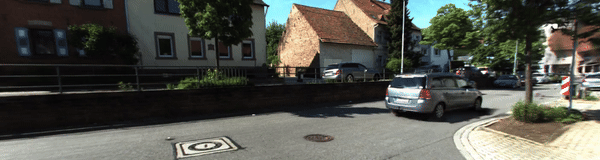

<div align="center">

# VEGS: View-Extrapolation of Urban Scenes in 3D Gaussian Splatting using Learned Priors

<font size="6">
<a href="https://deepshwang.github.io/" style="font-size:100%;">Sungwon Hwang</a>*<sup>1</sup>&emsp;
<a href="https://vegs.github.io" style="font-size:100%;">Min-Jung Kim</a>*<sup>1</sup>&emsp;
<a href="https://vegs.github.io" style="font-size:100%;">Taewoong Kang</a><sup>1</sup>&emsp;
<a href="https://vegs.github.io" style="font-size:100%;">Jayeon Kang</a><sup>2</sup>&emsp;
<a href="https://sites.google.com/site/jaegulchoo/" style="font-size:100%;">Jaegul Choo</a><sup>1</sup>&emsp;
</font>

<br>

<font size="4">
*: Equal contribution
</font>


<br>

<font size="6">
KAIST<sup>1</sup>, Ghent University<sup>2</sup>
</font>

<br>

<font size="4">
| <a href="https://vegs.github.io">Project Page</a> | <a href="https://arxiv.org/abs/2311.12775">arXiv</a> | <a href="https://github.com/deepshwang/vegs">Code</a>
</font>

<br>

<br>

 <br>
<b>Our method aligns and flattens Gaussian covariances to scene surfaces estimated from </br> monocular normal estimations.</b>

 <br>
<b>Our method jointly reconstructs dynamic object such as cars. Reconstructed dynamic object can then be arbitrarily relocated.</b>

</div>


## Abstract
Neural rendering-based urban scene reconstruction methods commonly rely on images collected from driving vehicles with cameras facing and moving forward. Although these methods can successfully synthesize from views similar to training camera trajectory, directing the novel view outside the training camera distribution does not guarantee on-par performance. In this paper, we tackle the Extrapolated View Synthesis (EVS) problem by evaluating the reconstructions on views such as looking left, right or downwards with respect to training camera distributions. To improve rendering quality for EVS, we initialize our model by constructing dense LiDAR map, and propose to leverage prior scene knowledge such as surface normal estimator and large-scale diffusion model. Qualitative and quantitative comparisons demonstrate the effectiveness of our methods on EVS. To the best of our knowledge, we are the first to address the EVS problem in urban scene reconstruction. We will release the code upon acceptance.

## Installation

### 1. Requirements

The software requirements are the following:
- Conda (recommended for easy setup)
- C++ Compiler for PyTorch extensions
- CUDA toolkit 11.8 for PyTorch extensions
- C++ Compiler and CUDA SDK must be compatible

Please refer to the original <a href="https://github.com/graphdeco-inria/gaussian-splatting">3D Gaussian Splatting repository</a> for more details about requirements.

### 2. Clone the repository

```shell
# HTTPS
git clone https://github.com/deepshwang/vegs.git --recursive
```

or

```shell
# SSH
git clone git@github.com:deepshwang/vegs.git --recursive
```

### 3. Install packages

Create and activate the environemnt with the required packages installed.

```shell
conda env create -f environment.yml
conda activate vegs
```

## Dataset Preparation

We provide training pipeline for <a href="https://www.cvlibs.net/datasets/kitti-360/">KITTI-360</a> Dataset. Pleaser refer to the data <a href="https://www.cvlibs.net/datasets/kitti-360/documentation.php">documentation</a> for details on the data structure. 

### 1. Download Data
You may register and log-in for <a href="https://www.cvlibs.net/datasets/kitti-360/">KITTI-360</a> page. Then, please download the following data.

```
KITTI-360
└───calibration
└───data_2d_raw
│   └───2013_05_28_drive_{seq:0>4}_sync
└───data_3d_semantics
│   └───train
│       └───static
│           └───{start_frame:0>10}_{end_frame:0>10}.ply
│       └───dynamic
│           └───{start_frame:0>10}_{end_frame:0>10}.ply
└───data_3d_bboxes
│   └───train
│       └───2013_05_28_drive_{seq:0>4}_sync.xml
│   └───train_full
│       └───2013_05_28_drive_{seq:0>4}_sync.xml
└───data_poses
│   └───2013_05_28_drive_{seq:0>4}_sync
```
**Since each sequence is too large to construct as a single scene model, we use scene segment pre-divided by frames, `start_frame` and `end_frame`.**

### 2. Prepare 3D points triangulated from training images and known camera poses using COLMAP.
In addition to the LiDAR map, we use points triangulated from training images. To prepare the points, run the following command. (COLMAP must be installed to run)
```
python triangulate.py --data_dir ${KITTI360_DIR}
```

where `${KITTI360_DIR}` is the KITTI-360 data directory. By default, the script will triangulate for all scene sgements in data, and save the results in `data_3d_colmap` and `data_3d_colmap_processed` folder under the KITTI-360 data directory. 

### 3. Prepare Monocular Surface Normal Estimations


### 4. Prepare LoRA training images
To prepare dataset for LoRA training, run the following command.
```
bash bash_scripts/lora_preprocess_kitti360.sh
```
This will prepare square-cropped dataset and save them into `lora/data/kitti360`.

By default, this will prepare images for scene segments listed in `lora/data/kitti360/2013_05_28_drive_train_dynamic_vehicle_human_track_num_vehicles.txt`, which includes scene fragements where vehicles are the only dynamic objects in the scene (as our method cannot handle topologically-varying dynamic objects such as walking people). You may change the text file to only process the scene segment of interest.


## Training

### 0. Fine-tune Stable-Diffusion model with LoRA.
To train Stable-Diffusion model with LoRA, run the following command.

```
bash bash_scripts/lora_train_kitti360.sh ${GPU_NUM}
```

By default, the script will train fine-tuned models for all scene segments listed in `lora/data/kitti360/2013_05_28_drive_train_dynamic_vehicle_human_track_num_vehicles.txt`. 

### 1. Train VEGS 
To train VEGS for a scene segment of interest, run the following command.

```
bash bash_scripts/train_kitti360.sh ${GPU_NUM} ${SEQUENCE} ${START_FRAME} ${END_FRAME} ${EXPERIMENT_NOTE}
```

| Parameter | Description | Default |
| :-------: | :--------: | :--------: |
| `${GPU_NUM}`  | Index of GPU to use.|  `0` |
| `${SEQUENCE}`  | Index of sequence to train | `0006`|
| `${START_FRAME}`  | Start frame number of the frame segment | `9038`|
| `${END_FRAME}`  | End frame number of the frame segment | `9223`|
| `${EXP_NOTE}`  | Optional note for the run. </br> The note will be included to the folder that the model will be saved. | `""` |

Trained model and images rendered on conventional and extrapolated cameras will be saved in `output`. 

## Video Rendering

We also provide a script to render and save from training camera trajectories, along with novel cameras interpolated between adjacent pairs of training cameras for smooth video rendering. Run the following command.
```
bash bash_scripts/render_video.sh ${GPU_NUM} ${MODEL_PATH}
```

where `${MODEL_PATH}` is the path of the trained gaussian model. Running the script will give you smooth video renderings from both interpolated and extrapolated views. 